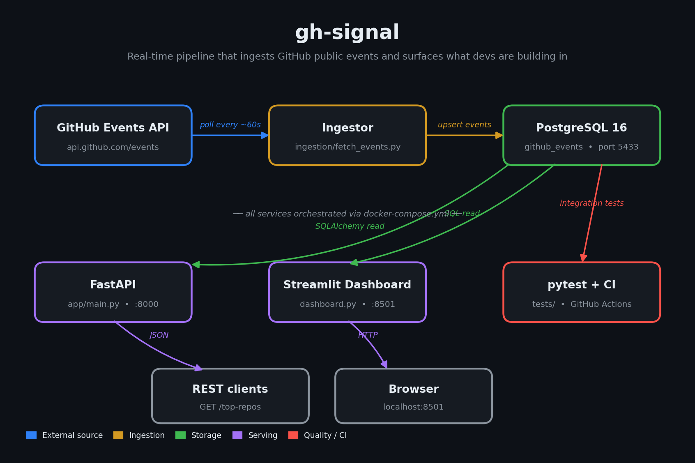

# GH Signal

A real-time data pipeline that ingests public GitHub events, processes them, and exposes analytics via an API.

## Overview

This project builds a lightweight backend/data engineering system using the GitHub Events API. It demonstrates:

- API ingestion with rate limiting
- Idempotent data processing
- Relational data modeling
- Analytics queries over event streams
- REST API for insights

## Architecture



```
GitHub Events API ──► Ingestion Service ──┐
                                          ├──► PostgreSQL ──► FastAPI ──► Analytics Endpoints
GitHub Repos API  ──► Enrichment Service ─┘                       │
                                                                  └──► Streamlit Dashboard
```

The ingestion service polls the public events firehose; the enrichment service walks the resulting repo names and pulls language/topic metadata so the analytics layer can answer "what are devs *actually building in* right now?"

## Tech Stack

- Backend: FastAPI
- Database: PostgreSQL
- ORM: SQLAlchemy
- Migrations: Alembic
- Ingestion + enrichment: Python + Requests
- Dashboard: Streamlit
- (Planned) Queue: Redis / Kafka
- (Planned) Orchestration: Airflow

## Features

### Data Ingestion
- Polls GitHub Events API every minute
- Handles duplicate events using upsert logic
- Extracts key fields: repo, actor, event type, timestamp

### Repo Enrichment
- Background worker fetches repo metadata (language, topics) for repos that appear in the events stream
- Authenticated against GitHub with a personal access token (5,000 req/hr)
- Skips deleted/private repos and rate-limit responses gracefully

### Storage
- Normalized `events` schema with indexed fields for fast queries
- Separate `repos` table for enrichment data, joined on repo name
- Schema versioned via Alembic migrations

### API Endpoints

#### `GET /top-repos`
Returns most active repositories by event count

#### `GET /`
Health check endpoint

## Example Response

```json
[
  {"repo": "torvalds/linux", "count": 42},
  {"repo": "microsoft/vscode", "count": 35}
]
